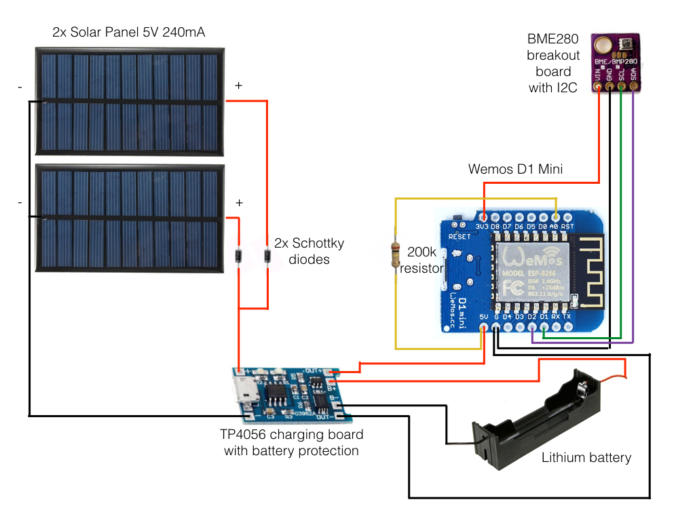

# Wemos D1 Mini - BME280 Weather Station
Simple Weather Station Code using an ESP8266 and a BME280 sensor. Data is handled via PHP script. The code is optimized for baterry usage and it offers a buffer for when there is no internet connection available.

#### Parts List:
- 1x Wemos D1 Mini ESP8266 development board
- 1x BME280 breakout board
- 1x TP4056 charging board with battery protection
- 2x Solar panels 5V 240mA (or one bigger one)
- 1x Battery holder for 18650 batteries
- 1x 18650 lithium ion battery
- 2x Schottky diodes
- 1x 200k Ohm resistor

#### Schematic:

